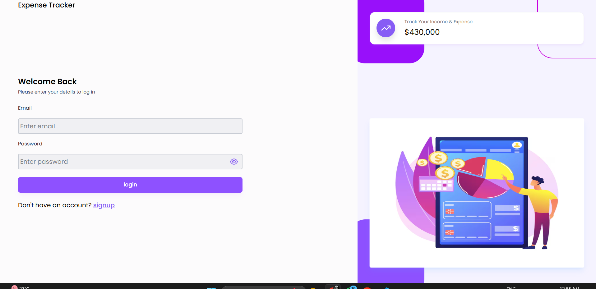
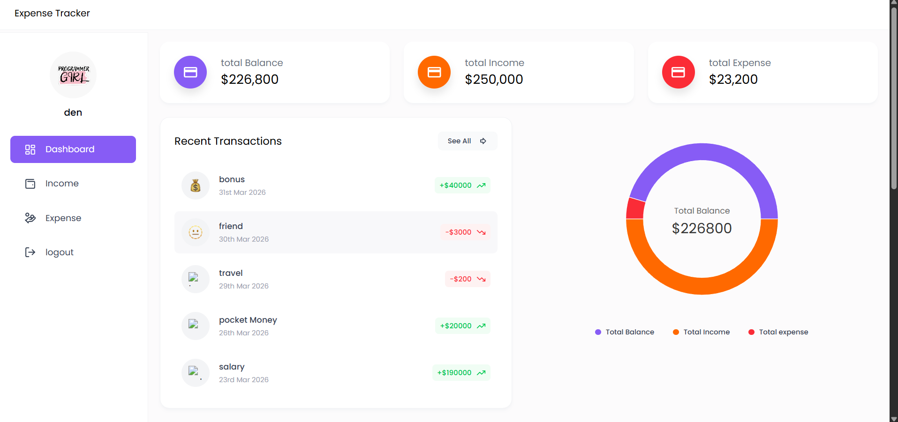
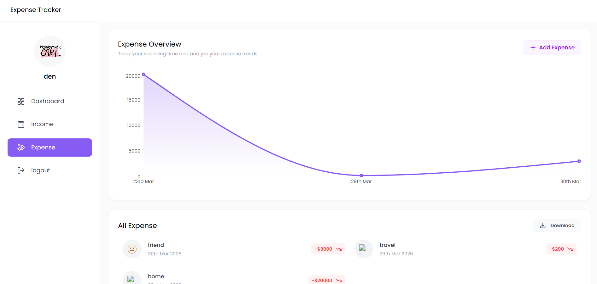

# 💸 Expense Tracker

A full-stack personal finance management web application built with the **MERN Stack**. Track your income and expenses, visualize financial trends with interactive charts, export data to Excel, and manage your finances all in one place.

> 🚧 This project is actively maintained and will continue to receive new features and improvements over time.

---

## 📸 Screenshots

### 🔐 Login Page


### 📊 Dashboard


### 💸 Expense Page


---

## ✨ Features

### 🔐 Authentication & Security
- User registration with **profile picture upload**
- Secure login with **JWT (JSON Web Tokens)**
- Password hashing with **bcryptjs**
- Protected frontend routes — unauthorized users redirected to login
- Token stored in localStorage, sent via Authorization header
- Auto redirect to login on token expiry (401 response)

### 📊 Dashboard
- **Total Balance**, **Total Income**, **Total Expense** summary cards
- **Finance Overview** — donut/pie chart showing balance, income, expense breakdown
- **Recent Transactions** — combined list of latest income and expense entries
- **Last 30 Days Expenses** bar chart
- **Last 60 Days Income** line chart
- All data fetched dynamically from MongoDB aggregation queries

### 💰 Income Management
- Add income with **source**, **amount**, **date**, and **emoji icon**
- View all income entries in a responsive card list
- Delete income with a confirmation modal
- **Bar chart** showing income trends grouped by date
- **Download income data as Excel (.xlsx)**

### 💸 Expense Management
- Add expenses with **category**, **amount**, **date**, and **emoji icon**
- View all expense entries in a responsive card list
- Delete expenses with a confirmation modal
- **Area/Line chart** showing expense trends grouped by date
- **Download expense data as Excel (.xlsx)**

### 🎨 UI / UX
- Fully **responsive** — works on mobile, tablet, and desktop
- **Sticky sidebar** navigation with active menu highlighting
- **Emoji picker** for visually categorizing transactions
- **Toast notifications** for all user actions (add, delete, download, errors)
- **Loading spinner** while fetching data on page refresh
- **Modal dialogs** for adding and deleting entries
- Custom **Recharts** bar, line/area, and pie charts with tooltips
- Hover-to-reveal delete button on transaction cards

---

## 🛠️ Tech Stack

### Frontend
| Technology | Purpose |
|---|---|
| React.js (Vite) | UI framework |
| React Router DOM | Client-side routing & protected routes |
| Tailwind CSS | Utility-first styling |
| Axios | HTTP client with interceptors |
| Recharts | Interactive data visualization |
| React Hot Toast | Toast notifications |
| Moment.js | Date formatting |
| React Icons | Icon library |
| Emoji Picker React | Emoji selection for transactions |

### Backend
| Technology | Purpose |
|---|---|
| Node.js | Runtime environment |
| Express.js | REST API framework |
| MongoDB | NoSQL database |
| Mongoose | ODM / schema modeling |
| JSON Web Token (JWT) | Authentication |
| bcryptjs | Password hashing |
| ExcelJS | Excel file generation & download |
| Multer | Profile image upload |
| Cookie Parser | Cookie management |
| CORS | Cross-origin resource sharing |
| dotenv | Environment variable management |

---

## 📁 Project Structure

```
expense-tracker/
│
├── backend/
│   ├── controllers/
│   │   ├── Auth.controller.js        # Register, Login, Get User
│   │   ├── Dashboard.controller.js   # Aggregated dashboard data
│   │   ├── Income.controller.js      # Add, Get, Delete, Download Income
│   │   └── Expense.controller.js     # Add, Get, Delete, Download Expense
│   │
│   ├── models/
│   │   ├── User.model.js             # User schema with JWT methods
│   │   ├── Income.model.js           # Income schema
│   │   └── Expense.model.js          # Expense schema
│   │
│   ├── routes/
│   │   ├── auth.routes.js
│   │   ├── income.routes.js
│   │   ├── expense.routes.js
│   │   └── dashboard.routes.js
│   │
│   ├── middleware/
│   │   ├── authMiddleware.js         # JWT verification middleware
│   │   └── multer.middleware.js      # Image upload middleware
│   │
│   ├── utils/
│   │   ├── ApiError.js               # Custom error class
│   │   ├── ApiResponse.js            # Standardized API response
│   │   └── AsyncHandler.js           # Async error wrapper
│   │
│   ├── db/
│   │   └── index.js                  # MongoDB connection
│   │
│   └── index.js                      # Express app entry point
│
└── frontend/
    └── src/
        ├── components/
        │   ├── Card/
        │   │   ├── CharAvatar.jsx        # Character avatar from initials
        │   │   ├── InfoCard.jsx          # Summary stat cards
        │   │   └── TransactionInfoCard.jsx
        │   │
        │   ├── chart/
        │   │   ├── CustomBarChart.jsx    # Income bar chart
        │   │   ├── CustomLineChart.jsx   # Expense area chart
        │   │   ├── CustomTooltip.jsx     # Shared chart tooltip
        │   │   ├── CustomLegend.jsx      # Chart legend
        │   │   └── CustomPieChart.jsx    # Finance overview donut chart
        │   │
        │   ├── dashBoard/
        │   │   ├── RecentTransaction.jsx
        │   │   ├── FinanceOverview.jsx
        │   │   ├── ExpenseTransactions.jsx
        │   │   ├── Last30DaysExpenses.jsx
        │   │   ├── RecentIncomeWithChart.jsx
        │   │   └── RecentIncome.jsx
        │   │
        │   ├── Expense/
        │   │   ├── AddExpenseForm.jsx
        │   │   ├── ExpenseList.jsx
        │   │   └── ExpenseOverview.jsx
        │   │
        │   ├── Income/
        │   │   ├── AddIncomeForm.jsx
        │   │   ├── IncomeList.jsx
        │   │   └── IncomeOverview.jsx
        │   │
        │   ├── inputs/
        │   │   ├── Input.jsx
        │   │   └── ProfilePhotoSelector.jsx
        │   │
        │   ├── layouts/
        │   │   ├── AuthLayout.jsx
        │   │   ├── DashboardLayout.jsx
        │   │   ├── Navbar.jsx
        │   │   └── Sidemenu.jsx
        │   │
        │   ├── Modal.jsx
        │   └── DeleteAlert.jsx
        │
        ├── context/
        │   ├── UserContext.jsx
        │   └── UserProvider.jsx
        │
        ├── hooks/
        │   └── useUserAuth.jsx
        │
        ├── pages/
        │   ├── Auth/
        │   │   ├── Login.jsx
        │   │   └── Signin.jsx
        │   └── Dashboard/
        │       ├── Home.jsx
        │       ├── Income.jsx
        │       └── Expense.jsx
        │
        ├── utils/
        │   ├── apiPaths.js
        │   ├── axiosinstance.js
        │   ├── data.js
        │   ├── helper.js
        │   └── uploadImage.js
        │
        └── App.jsx
```

---

## ⚙️ Getting Started

### Prerequisites
- Node.js v18+
- MongoDB (local or MongoDB Atlas)
- npm or yarn

### 1. Clone the repository
```bash
git clone https://github.com/aymansiddiqui2006/expense-tracker.git
cd expense-tracker
```

### 2. Setup Backend
```bash
cd backend
npm install
```

Create a `.env` file in the `backend/` folder:
```env
PORT=8000
DB_URL=mongodb://localhost:27017/expense-tracker
ACCESS_TOKEN=your_access_token_secret
ACCESS_TOKEN_EXPIRE=1d
REFRESH_TOKEN=your_refresh_token_secret
REFRESH_TOKEN_EXPIRE=7d
```

Start the backend:
```bash
npm run dev
```

### 3. Setup Frontend
```bash
cd frontend
npm install
npm run dev
```

### 4. Open in browser
```
http://localhost:5173
```

---

## 🔌 API Reference

### 🔐 Auth Routes — `/api/v1/auth`
| Method | Endpoint | Auth | Description |
|---|---|---|---|
| POST | `/register` | ❌ | Register new user |
| POST | `/login` | ❌ | Login and get token |
| GET | `/get-user` | ✅ | Get logged in user info |
| POST | `/upload-image` | ✅ | Upload profile image |

### 📊 Dashboard Routes — `/api/v1/dashboard`
| Method | Endpoint | Auth | Description |
|---|---|---|---|
| GET | `/` | ✅ | Get all dashboard summary data |

### 💰 Income Routes — `/api/v1/income`
| Method | Endpoint | Auth | Description |
|---|---|---|---|
| POST | `/add` | ✅ | Add new income entry |
| GET | `/get` | ✅ | Get all income entries |
| DELETE | `/:id` | ✅ | Delete income by ID |
| GET | `/download-excel` | ✅ | Download income as Excel |

### 💸 Expense Routes — `/api/v1/expense`
| Method | Endpoint | Auth | Description |
|---|---|---|---|
| POST | `/add` | ✅ | Add new expense entry |
| GET | `/get` | ✅ | Get all expense entries |
| DELETE | `/:id` | ✅ | Delete expense by ID |
| GET | `/download-excel` | ✅ | Download expenses as Excel |

---

## 🔒 Environment Variables

| Variable | Description |
|---|---|
| `PORT` | Backend server port (default: 8000) |
| `DB_URL` | MongoDB connection string |
| `ACCESS_TOKEN` | Secret key for signing access tokens |
| `ACCESS_TOKEN_EXPIRE` | Access token expiry (e.g. `1d`) |
| `REFRESH_TOKEN` | Secret key for signing refresh tokens |
| `REFRESH_TOKEN_EXPIRE` | Refresh token expiry (e.g. `7d`) |

---

## 🚀 Upcoming Features

- [ ] **Budget Goals** — Set monthly limits and get alerts when exceeded
- [ ] **Custom Categories** — Create and manage your own income/expense categories
- [ ] **Recurring Transactions** — Schedule automatic recurring entries
- [ ] **Dark Mode** — Full dark theme support
- [ ] **Multi-currency Support** — Track finances in different currencies
- [ ] **PDF Reports** — Generate and download detailed PDF financial reports
- [ ] **Email Notifications** — Monthly financial summary via email
- [ ] **Google OAuth** — Sign in with Google
- [ ] **Data Import** — Import transactions from CSV or bank statements
- [ ] **Search & Filter** — Search transactions by date, amount, or category
- [ ] **Mobile App** — React Native version for iOS and Android

---

## 🤝 Contributing

Contributions, issues, and feature requests are welcome!

1. Fork the repository
2. Create your feature branch (`git checkout -b feature/AmazingFeature`)
3. Commit your changes (`git commit -m 'Add AmazingFeature'`)
4. Push to the branch (`git push origin feature/AmazingFeature`)
5. Open a Pull Request

---

## 📄 License

This project is licensed under the **MIT License** — see the [LICENSE](LICENSE) file for details.

---

## 👨‍💻 Author

**Ayman Siddiqui**
- GitHub: [@aymansiddiqui2006](https://github.com/aymansiddiqui2006)

---

> ⭐ If you found this project helpful, please give it a star on GitHub — it means a lot!
